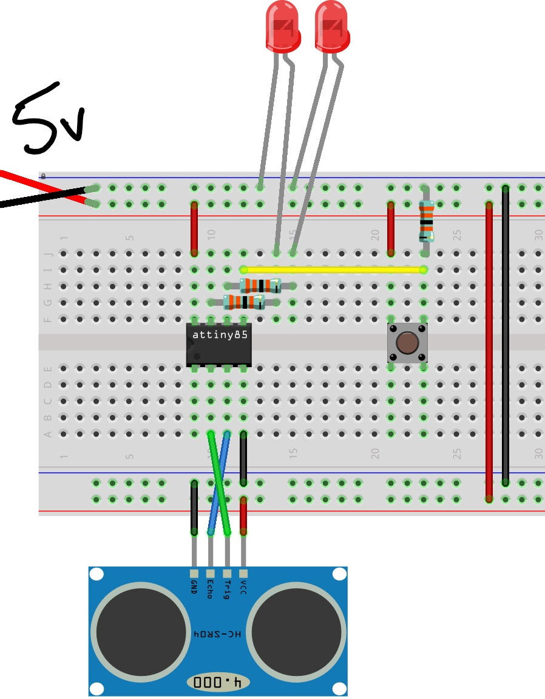
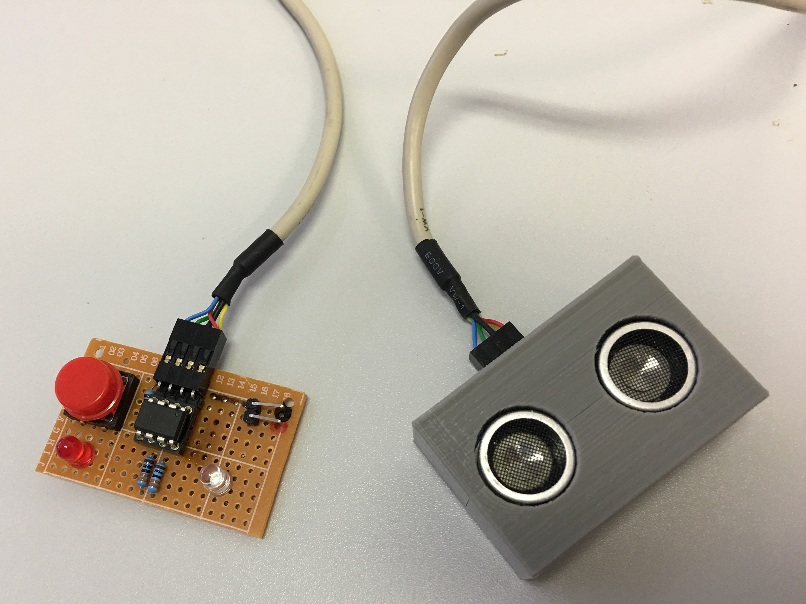
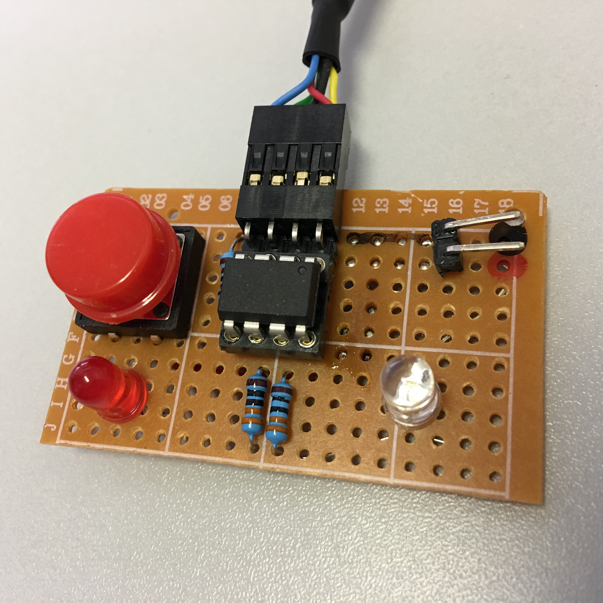

# distanceSensor

Tring to practice social distancing? Strap this bad boy to your shirt!

Want to park your car without hitting the wall? Stick this in your garage!

I thought I'd have a go at using an ATtiny85 for this project. They have just enough GPIO for two LEDs, a button, and a HC-SR04 ultrasonic distance sensor.

The idea is that a LED blinks increasingly faster as things get closer until it lights up solid indicating the "Stop Distance" has been reached. The button can be used to set a new "Stop Distance", and the other LED is there to indicate that the new "Stop Distance" has been set successfully. It runs on 5v from a USB cable.

