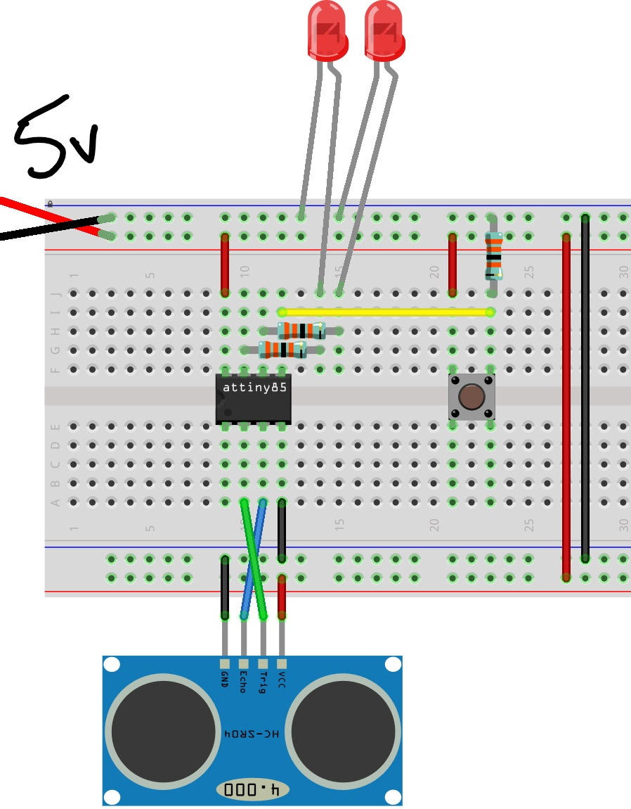
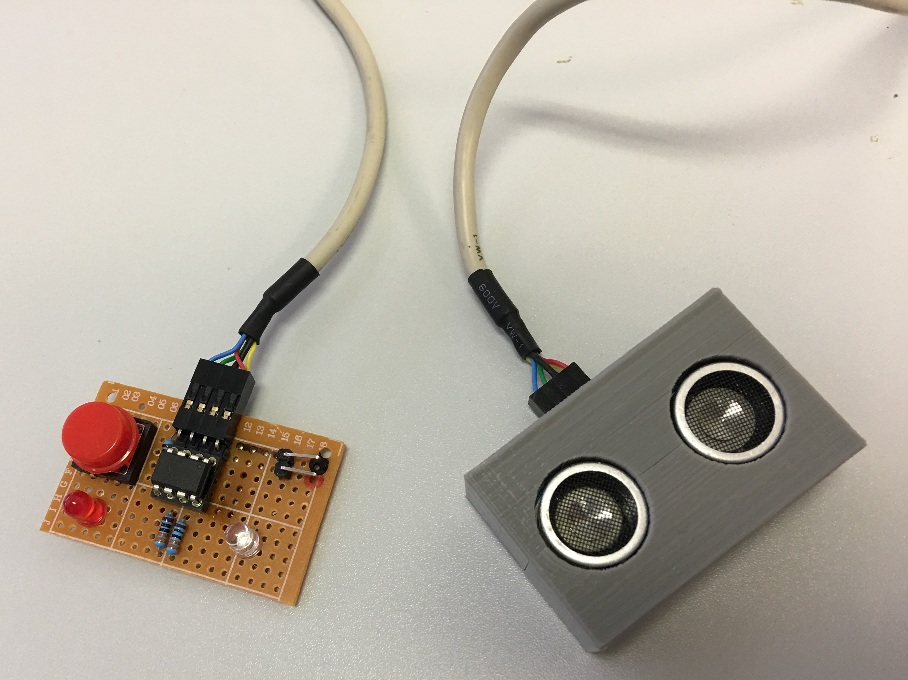

# reverseParkSensor

Parking the car without smashing into the wall can be a tough task... well, not anymore with this “Parking Sensor”!

I thought I’d have a go at using the ATtiny85’s I bought a while ago. They have just enough GPIO for two LEDs, a button, and a HC-SR04 ultrasonic distance sensor.

The idea is that a LED blinks increasingly faster as you get closer until it goes solid, indicating you should stop the car. The button can be used to set a new "Stop Distance", and the other LED is there to indicate that the new "Stop Distance" has been set successfully. It runs on 5v from a USB cable.

